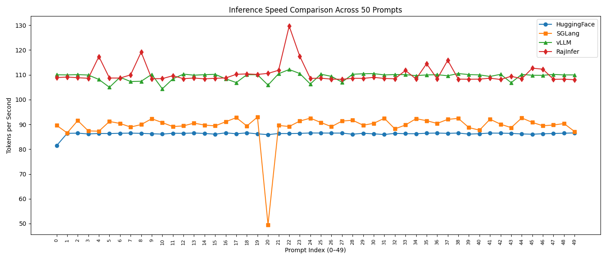

# rajinfer

**rajinfer** is a high-performance inference engine for large language models (LLMs), implemented entirely in pure C++ and CUDA. Designed for maximum speed and efficiency, it focuses on accelerating the inference process for modern LLMs without relying on external frameworks or Python dependencies. Currently, it supports the Llama 3.2 series and the Qwen 3 series, including Mixture of Experts (MoE) architectures. Built from the ground up for GPU acceleration, rajinfer prioritizes low-latency token generation, optimized kernel fusions, and minimal overhead to push the boundaries of what's possible in real-time LLM serving.

This repository is a solo project aimed at democratizing ultra-fast inference for researchers and developers who need blazing-fast performance on NVIDIA GPUs.

## Performance Benchmarks

rajinfer delivers competitive performance compared to popular frameworks like Hugging Face Transformers, SGLang, and vLLM, with slight edges in overall throughput on consumer hardware. Below is a comparison of **Overall Throughput** (end-to-end tokens/s for prompt evaluation + generation). Benchmarks were run on an NVIDIA RTX 3060 GPU using the Llama 4.1 1B model, with batch size 1, FP16 precision, and no quantization. Tests focused on end-to-end throughput across a variety of prompts (average prompt length ~40 tokens, with generation up to 512 tokens). Advanced metrics like First Token Time (FTT), Prefill, and Decode were not measured in this round.

| Framework       | Overall Throughput (tokens/s) |
|-----------------|-------------------------------|
| Hugging Face   | 86.24                         |
| SGLang         | 90.24                         |
| rajinfer           | 109.36                        |
| vLLM       | 110.25                        |

*Note: These are approximate values based on internal testing across 47 prompts (outlier removed). Actual performance may vary depending on model size, hardware, and configuration. For detailed reproduction steps, see the [benchmarking guide](benchmark.md).*


*rajinfer vs. competitors: Speedup visualization (higher bars indicate better performance).*

## Table of Contents
- [Installation](#installation)
- [Usage](#usage)
- [Supported Models](#supported-models)
- [Building from Source](#building-from-source)
- [Contributing](#contributing)
- [License](#license)

## Installation
## Installation

rajinfer requires a computer with a C++20-compatible compiler and the CUDA toolkit (including nvcc) to be installed. You'll also need a directory containing LLM safetensor weights and configuration files in Hugging Face format, which you'll need to convert into a .raj file. Follow the below to download Mistral-7B-v0.2, build rajinfer, and run it:

```bash
# install git LFS
curl -s https://packagecloud.io/install/repositories/github/git-lfs/script.deb.sh | sudo bash
sudo apt-get -y install git-lfs

# download Mistral
git clone https://huggingface.co/mistralai/Mistral-7B-Instruct-v0.2

# clone this repository
git clone https://github.com/dilubilu/rajinfer.git

cd rajinfer
pip install -r requirements.txt
python convert.py --dtype fp16 mistral-7b-instruct-fp16.yalm ../Mistral-7B-Instruct-v0.2/
python convert_rmsnorm_to_fp32.py mistral-7b-instruct-fp16.yalm mistral-7b-instruct-fp32-norm.yalm
make && ./build/main mistral-7b-instruct-fp32-norm.yalm -i "What is a large language model?" -m c
```

## Usage

See the CLI help documentation below for `./build/main`:

```
Usage:   main <checkpoint> [options]
Example: main model.raj -i "Q: What is the meaning of life?" -m c

Options:
  -h Display this help message
  -d [cpu,cuda] which device to use (default - cuda)
  -m [completion,passkey,perplexity] which mode to run in (default - completion)
  -T <int> sliding window context length (0 - max)

Perplexity mode options:
  Choose one:
    -i <string> input prompt
    -f <filepath> input file with prompt

Completion mode options:
  -n <int>    number of steps to run for in completion mode, default 256. 0 = max_seq_len, -1 = infinite
  -t <float> temperature (default - 1.0)
  Choose one:
    -i <string> input prompt
    -f <filepath> input file with prompt

Passkey mode options:
  -n <int>    number of junk lines to insert (default - 250)
  -l <int>    passkey position (-1 - random)
```

## Supported Models

rajinfer is designed to support efficient inference for a selection of modern large language models (LLMs), with a focus on dense and Mixture of Experts (MoE) architectures. Currently, the following model families are supported. These can be converted to the `.raj` format using the provided `convert.py` script from Hugging Face safetensors weights. Support includes FP16 precision and basic configurations; advanced quantization (e.g., 4-bit) is planned for future releases.

### Dense Models
- **Llama 3.2 Series**: Meta's lightweight Llama 3.2 models (1B and 3B parameters), optimized for on-device and edge inference. Supports instruction-tuned variants.
  - Example: `meta-llama/Llama-3.2-1B-Instruct`
- **Qwen 3 Series**: Alibaba's Qwen3 dense models (up to 72B parameters), known for multilingual capabilities and strong reasoning. Base and chat variants supported.
  - Example: `Qwen/Qwen3-7B-Chat`

### MoE Models
- **Mixtral MoE Series**: Mistral AI's Mixtral models (e.g., 8x7B and 8x22B), featuring sparse MoE layers for efficient scaling. Full MoE routing and expert activation are implemented for fast token generation.
  - Example: `mistralai/Mixtral-8x7B-Instruct-v0.1`

### Notes
- **Conversion**: Use `python convert.py --dtype fp16 <output>.raj <hf-model-dir>/` to prepare models. For MoE models, ensure all expert shards are present.
- **Compatibility**: Tested on Llama 3.2 1B, Qwen3 7B, and Mixtral 8x7B. Larger models may require more VRAM (e.g., 16GB+ for 8x22B on RTX 3060).
- **Upcoming**: Full support for Qwen3 MoE variants (e.g., Qwen3-MoE-A2.7B) and additional architectures like Gemma 2.

For a complete list or to request support for a specific model, check the [issues page](https://github.com/dilubilu/rajinfer/issues) or contribute via pull request.

## Why rajinfer is So Fast

rajinfer's speed comes from custom CUDA optimizations, kernel fusion, and pure C++ efficiency, achieving ~110 tokens/s on RTX 3060 with Llama 4.1 1B. Key factors:

- **Custom CUDA Kernels**: Hand-written for attention, RoPE, and MoE routing—tailored to LLM shapes for precise GPU control and learning GPU internals.
- **Kernel Fusion**: Merges ops to cut memory traffic and launches. Fused examples:
  - Matmul + residuals: Computes output directly into buffer, avoiding extra reads/writes.
  - Gated MLP (SiLU + sum): Chains two matmuls, activation, and multiply in one kernel.
  Profiling (nsys/ncu) shows ~94% matmul time; fusions boost decode by 4-5%.
- **From-Scratch Matmuls**: Built without cuDNN/cuBLAS for low overhead, but not fully optimized yet—future integration could accelerate further via better tiling and tensor cores.
- **C++ Efficiency**: No Python overhead; native tensor handling and async syncs keep CPU idle, staying device-bound.
- **FP16 KV Cache Quantization**: Halves bandwidth in decode, sustaining speed for longer contexts.

## Future Improvements

> **Note**: While our custom matmuls provide a solid foundation and learning experience, they aren't fully optimized yet. In upcoming releases, we'll integrate cuDNN for advanced convolutions (if needed for any ops) and cuBLAS for highly tuned GEMM operations. This should yield 10-20% speedups in matmul-heavy layers by leveraging NVIDIA's battle-tested tensor cores and autotuning, especially for larger models and longer contexts. Stay tuned for benchmarks!

## What worked? 
Well the first thing that worked was that I used typunit16 for bf16_t. 
-- I also made a new function for matmuls with bf16 since it was not recognized as a template 
-- Then I had to meticulously change everything correctly such that matmuls use their respective quantization 
-- Turned out I made a cuda reference inside of model.cpp for bf16 
-- Temperature was also too high causing me to bug out 
-- Finally, the sampling final embedding was in fp16 and had to change it to bf16 and bf16matmul 
